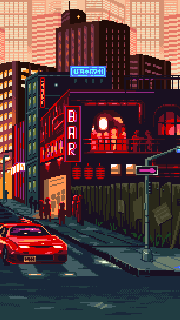
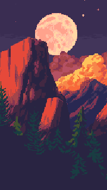
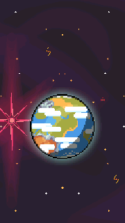

  

<h1 align="center">BelleWall</h1>

Animated wallpapers for your Symbian Belle homescreen.

<a href="README.md">简体中文</a> · English

  <a href="https://github.com/huayuechenfeng/BelleWall/releases/latest">Download</a> ·
  <a href="#getting-started">Getting started</a> ·
  <a href="doc/RELEASE-1.3.0.md#english">Release notes</a>

BelleWall plays animated wallpapers behind your phone's native homescreen icons and widgets. Convert a favourite video into a wallpaper package, or use a live web wallpaper while keeping your familiar homescreen controls.

## Features

- **Video wallpapers:** convert MP4 and other video sources to `.sywp`, with 20/30 fps settings and 360×640 canvases.
- **Wallpaper Engine conversion:** use the PC Workshop to convert pre-rendered video wallpapers exported from Wallpaper Engine as video-based MPKG packages into BelleWall-compatible `.sywp` files.
- **Live web wallpapers:** use content such as clocks, or write your own wallpaper.
- **Portrait and landscape:** rebuild the wallpaper when the screen rotates, with cover, contain and stretch options.
- **Pause and resume:** playback pauses when the phone is locked or the homescreen is hidden, and resumes on return. Stopping restores the native background.
- **Storage selection:** import wallpapers to C, E or F, depending on the drives available on your phone.
- **Chinese and English:** both the phone app and PC Workshop have bilingual interfaces.

Video wallpapers currently use RGB565 image frames, so files are larger than the source video. 30 fps is the playback request limit; actual smoothness depends on your phone and wallpaper.

## Wallpaper demos

Three free pixel-art wallpapers, ready to import into BelleWall 1.3:

| Neon City | Moonlit Mountains | Pixel Planet |
| --- | --- | --- |
|  |  |  |
| [Download SYWP](https://github.com/huayuechenfeng/BelleWall/releases/download/v1.3.0/BelleWall-Neon-City.sywp) | [Download SYWP](https://github.com/huayuechenfeng/BelleWall/releases/download/v1.3.0/BelleWall-Moonlit-Mountains.sywp) | [Download SYWP](https://github.com/huayuechenfeng/BelleWall/releases/download/v1.3.0/BelleWall-Pixel-Planet.sywp) |
| 8 seconds · 70.3 MiB | 8 seconds · 70.3 MiB | 7.7 seconds · 67.7 MiB |

All three use **360×640 RGB565 frames at 20 fps**. Copy a package to your phone, import it in **Wallpaper library**, then start playback. Prefer E/F storage and leave space for the imported copy. Landscape uses contain fitting with black margins.

These GIFs preview the actual converted frames at 180×320 and 10 fps; they are not phone recordings. Package and loop checks have passed; testing these three wallpapers on phones is pending. The original artwork is **CC0**: [sources, credits and reproduction instructions](assets/wallpapers/CREDITS.txt).

## Download

Current release: **1.3.0** · [What's new](doc/RELEASE-1.3.0.md#english)

Open the [GitHub Release page](https://github.com/huayuechenfeng/BelleWall/releases/latest) and choose a file under **Assets**:

| What you need | File to download |
| --- | --- |
| Install or update BelleWall on your phone | **`BelleWall-1.3.0.sisx`** |
| Create wallpapers on a Windows PC | **`BelleWall-1.3.0-tools.zip`** |
| Get the phone installer, sample wallpapers and standalone injector together | `BelleWall-1.3.0-injector.zip` (optional) |

**Most users need the SISX and tools ZIP.** The SISX includes every phone component; you do not need to install the injector separately. GitHub's automatic `Source code` downloads contain the source, rather than the installable app.

## Getting started

### 1. Install on your phone

You need a phone running **Symbian Belle**, **Qt 4.7.4 or later**, and the system permissions required by the app. Qt is not bundled. Firmware compatibility is described below.

1. If upgrading, select **Stop and restore desktop** in the old version, wait for restoration to finish, then exit.
2. Copy `BelleWall-1.3.0.sisx` to your phone and install it on drive C.
3. **Fully reboot the phone** before opening BelleWall.
4. For initial setup, set each homescreen page to the native default black background.

The app installs on C; your wallpaper library can use E or F when available.

### 2. Create a wallpaper

The PC Workshop runs on **64-bit Windows 10/11** and requires Node.js. FFmpeg is included.

1. Extract the entire `BelleWall-1.3.0-tools.zip` archive and run `Start-BelleWall.cmd` from its root folder.
2. Open the address shown in the command window in your browser. Keep that window open while using the Workshop.
3. Select a video, or a pre-rendered video wallpaper exported from Wallpaper Engine as an MPKG package, and set its canvas, crop and frame rate. Try `examples/demo.mp4` from the bundle first.
4. Select **Create wallpaper package**, then download the `.sywp` file.

For a lightweight first wallpaper, use **180×320, 10 fps and 100 frames**: about 10 seconds of looping content. Increase the dimensions or frame rate once playback works. Files are processed locally on your PC, with no uploads.

Already have a `.sywp` wallpaper? Go straight to the next step.

### 3. Import and play

1. Copy the `.sywp` file to your phone.
2. Open BelleWall's **Wallpaper library**, import the package and choose its storage drive.
3. Preview it, start the wallpaper, and select the **60-second check** for your first run.
4. Keep the phone unlocked while setup automatically switches homescreen pages. Once the check succeeds, you can use continuous playback.

Importing adds the wallpaper to your library; **you must also start playback**. Before changing wallpapers or ending playback, select **Stop and restore desktop**.

## Phone compatibility

All models use the same installer. BelleWall targets Symbian Belle; availability still depends on firmware, permissions and the homescreen environment.

- **Nokia E7:** users have reported successful playback, rotation and language switching.
- **Nokia 603:** earlier versions have been tested on hardware; regression testing of the current release is pending.
- **Nokia E6 and other models:** support for non-standard canvases has been added, but does not guarantee compatibility with every device. E6 has not been tested on hardware.

The E7 feedback above applies to the preceding 1.1 implementation. The new 1.3.0 installer has not yet undergone a separate device acceptance test. See the [release notes](doc/RELEASE-1.3.0.md#english) for the verification scope.

## Frequently asked questions

### Can I use an MP4 directly as a wallpaper?

**Compressed MP4 wallpaper playback is currently disabled.** You can still select MP4 source videos in the PC Workshop and convert them into RGB565 `.sywp` packages for your phone. Web wallpapers are also supported.

### Why are wallpaper files large, and why does importing take time?

RGB565 wallpapers store uncompressed image frames to reduce video decoding work during playback. A 10-second wallpaper at 360×640 and 30 fps contains about **132 MiB** of image data. Shorten the loop, lower the resolution or frame rate, and choose a drive with enough free space when importing.

### Nothing moves after installation or import. What should I do?

Make sure you have started playback. If you have just upgraded, fully reboot the phone and run the 60-second check again. If it still fails, export the app's diagnostics and include your phone model, firmware version, wallpaper type and error message when reporting the issue.

### Can I convert Wallpaper Engine wallpapers?

Yes. **The PC Workshop converts pre-rendered video wallpapers exported from Wallpaper Engine as video-based MPKG packages into BelleWall-compatible `.sywp` wallpapers.** Copy the result to your phone and import it. Live scenes, particles, models and SWF cannot be converted directly. Record or pre-render them as a video in the original tool first.

### How do I stop or uninstall BelleWall?

Select **Stop and restore desktop** to end playback. Before uninstalling, also run the app's uninstall preparation action and wait for it to succeed. Then remove BelleWall using the phone's application manager. Keep your original wallpaper files if you want to import them again later.

## More information

- [1.3 release notes — Chinese / English](doc/RELEASE-1.3.0.md)
- [Step-by-step wallpaper tutorial — Chinese](doc/BEGINNER.md)
- [Writing web wallpapers — Chinese](doc/WEB-AUTHORING.md)
- [Full documentation index — Chinese](doc/README.md)

Development and contributions: [Build instructions — Chinese](doc/BUILD.md) · [SYWP specification — Chinese](doc/SYWP-FORMAT.md)

Original code is licensed under [MIT](LICENSE). Third-party components retain their own licenses; see [sources and licenses](doc/SOURCES-AND-LICENSES.md).
